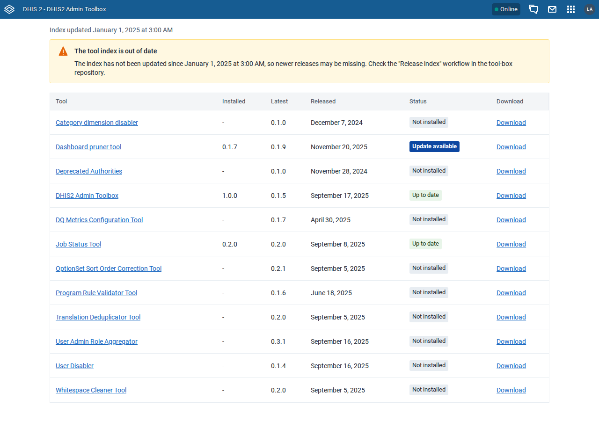

# Fixes: DHIS2 Admin Toolbox v1.0.0

Fixes for [REVIEW-FINDINGS.md](REVIEW-FINDINGS.md), on branch `release-1.0.0-fixes` (base
`8028a97`). Verified with `pnpm lint`, `pnpm test` (48), `pnpm test:index` (9) and the browser
suite on freshly built zips installed on DHIS2 2.40.12 and 2.43.1.

## H1. Upgrading from 0.1.x silently revokes role-based access to the app

- **Fix**: `d2.config.js` `name` is now `'DHIS2 Admin Toolbox'`, so the manifest `short_name`
  matches 0.1.x and DHIS2 derives the same key (`DHIS2-Admin-Toolbox`) and the same authority
  (`M_DHIS2_Admin_Toolbox`). `src/appIdentity.test.ts` models both derivations and fails if
  either drifts. The release workflow renames the bundle
  (`DHIS2 Admin Toolbox-<version>.zip` → `DHIS2-Admin-Toolbox-<version>.zip`) before attaching
  it. `CLAUDE.md`, the README and spec §6.1 are updated.
- **Verified**: on 2.40 and 2.43, a user whose role holds only `M_DHIS2_Admin_Toolbox` sees
  Toolbox 0.1.5 in `/api/apps`, and still sees it after installing the 1.0.0 build over it.
  The app key and authority are unchanged, and there is still only one app. Earlier
  variant-build runs covered 2.41 and 2.42 (see UI-TEST-RESULTS.md).

## M1. A stale index looks just like a current one

- **Fix**: `src/lib/isIndexStale.ts` (index older than 3 days). `Toolbox.tsx` then shows a
  warning notice, "The tool index is out of date", with the date and a pointer to the
  "Release index" workflow. The table still renders.
- **Verified**: unit tests for the threshold and an unparseable date, a Toolbox test for the
  notice, and a new e2e check (`check_stale_index`, which serves a copy of the live index with
  an old `generated_at`) passing on 2.40 and 2.43. `check_admin_table` asserts that the live
  index shows no notice.

## L1. `releaseUrl` is carried through but never shown

- **Fix**: the Download cell in `ToolsTable.tsx` falls back to a "Release page" link when a
  release has no https zip asset, and shows `-` only when neither URL is usable.
- **Verified**: unit tests for the fallback and for rejecting non-https URLs in both fields.
  The browser suite still sees only `https://github.com/` links.
