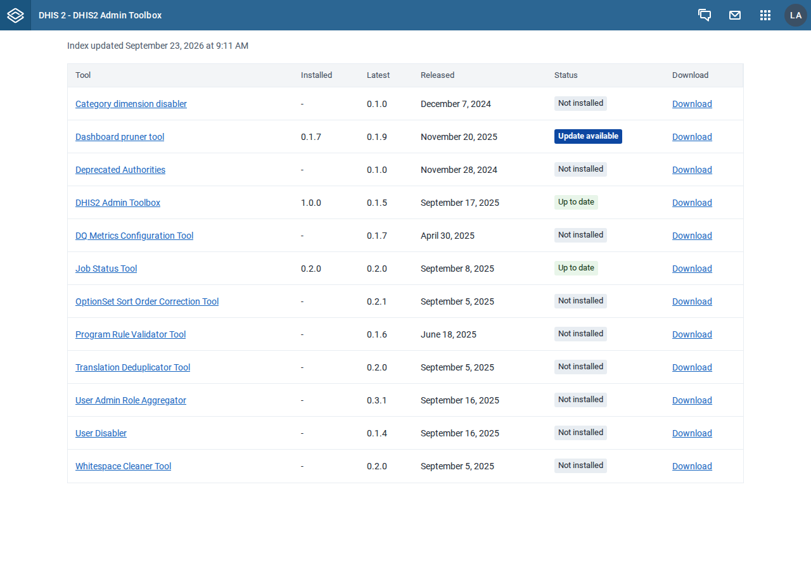
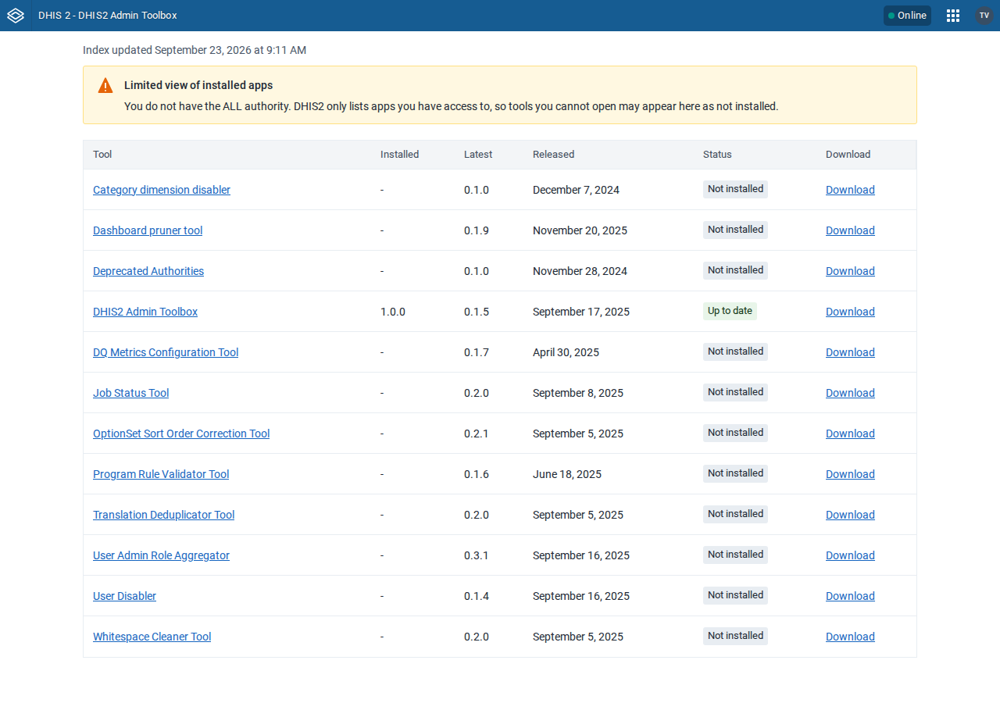
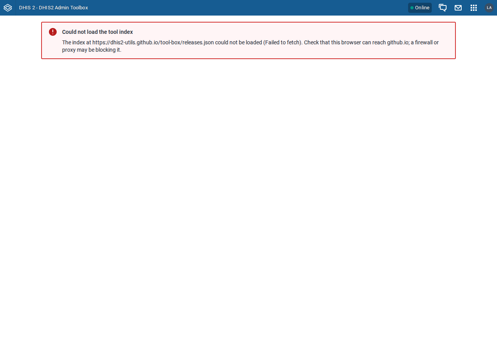
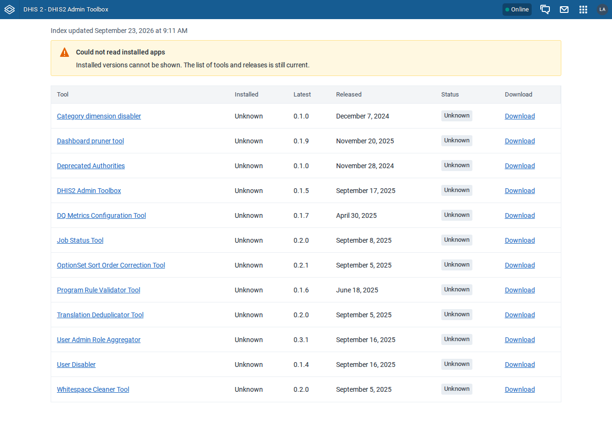

# UI test results: DHIS2 Admin Toolbox v1.0.0

Tested: 2026-09-23 · Build: `pnpm build` of `8028a97`, installed via `POST /api/apps` ·
Test data: empty instances (no seed), live release index
(`https://dhis2-utils.github.io/tool-box/releases.json`, 12 tools, generated 2026-09-23 09:11 UTC)

Suite: [`e2e/test_toolbox.py`](../../e2e/test_toolbox.py), setup in [`e2e/README.md`](../../e2e/README.md).

## Instances

One disposable instance at a time, each deleted after its pass.

| Label | DHIS2 version | App served |
|---|---|---|
| 2.40 | 2.40.12 | top level, `/api/apps/DHIS2-Admin-Toolbox/index.html` |
| 2.41 | 2.41.10 | top level |
| 2.42 | 2.42.6 | global-shell iframe |
| 2.43 | 2.43.1 | global-shell iframe |

Installed apps: Toolbox 1.0.0 (upgraded from 0.1.5), Job Status Tool 0.2.0 (latest),
Dashboard pruner tool 0.1.7 (latest is 0.1.9).

## Results

| Step | 2.40 | 2.41 | 2.42 | 2.43 | Notes |
|---|---|---|---|---|---|
| Install 0.1.5, then 1.0.0: upgrades in place (one app, key `DHIS2-Admin-Toolbox`) | PASS | PASS | PASS | PASS | install status 204 on ≤2.41, 201 on 2.42+ |
| Role-only user keeps access after 0.1.5 → 1.0.0 | **FAIL** | **FAIL** | **FAIL** | **FAIL** | authority renamed, see H1 |
| Same, with the H1 fix (`name: 'DHIS2 Admin Toolbox'`) | PASS | PASS | PASS | PASS | |
| Admin: 12 rows; Toolbox 1.0.0 and Job Status 0.2.0 "Up to date"; pruner 0.1.7 "Update available"; other 9 "Not installed" | PASS | PASS | PASS | PASS | |
| Admin: "Index updated" shown, no limited-view warning, all links `https://github.com/…` | PASS | PASS | PASS | PASS | |
| Admin: no app console errors or unexpected HTTP errors | PASS | PASS | PASS | PASS | see hygiene |
| Non-ALL user: limited-view warning; Toolbox listed; Job Status "Not installed" (hidden by DHIS2) | PASS | PASS | PASS | PASS | |
| Index unreachable: error notice naming the URL, no table | PASS | PASS | PASS | PASS | request aborted in browser |
| `/api/apps` 500: warning notice, every row "Unknown" | PASS | PASS | PASS | PASS | failure limited to the app's frame |
| Full suite on the H1-fix build | PASS | – | PASS | PASS | 2.41 covered by API checks only |

## Version-specific failures

None. H1 fails identically on every version.

## Console/network hygiene

Two expected messages, filtered by the suite:

- `404 /api/staticContent/logo_banner`: header bar, instance has no custom logo.
- `This window is not a secure context … PWA features will not work`: platform PWA code,
  because test instances are plain HTTP on a non-localhost host.

No other console errors, failed requests or 4xx/5xx responses.

## Screenshots

2.40, admin:

2.42, user without ALL:

2.42, index unreachable:

2.42, `/api/apps` failing:

